My notes on HTML, CSS, Sass and other things that help with the presentational stuff of the web.


<!-- @import "[TOC]" {cmd="toc" depthFrom=1 depthTo=6 orderedList=false} -->
<!-- code_chunk_output -->

* [HTML](#html)
	* [HTML semantics](#html-semantics)
		* [Images](#images)
		* [Containers](#containers)
		* [Forms](#forms)
		* [Tables](#tables)
			* [scope](#scope)
			* [colspan](#colspan)
		* [Other useful elements](#other-useful-elements)
* [CSS](#css)
	* [Cascade/Inheritance](#cascadeinheritance)
		* [CSS Selectors](#css-selectors)
			* [Multiple class/id/type selectors](#multiple-classidtype-selectors)
			* [Child combinator selector](#child-combinator-selector)
			* [Adjacent selector](#adjacent-selector)
			* [nth-of-type](#nth-of-type)
			* [Other selectors](#other-selectors)
		* [HTML/CSS files: Setup](#htmlcss-files-setup)
		* [Color](#color)
		* [Sizing](#sizing)
			* [Units](#units)
			* [Width](#width)
			* [Height](#height)
	* [Box Model](#box-model)
		* [display values and the box model](#display-values-and-the-box-model)
			* [inline](#inline)
			* [inline-block](#inline-block)
			* [Block](#block)
		* [box-sizing](#box-sizing)
			* [Adding spacing between floated or inline elements](#adding-spacing-between-floated-or-inline-elements)
		* [Spacing - margin and padding:](#spacing-margin-and-padding)
			* [Tip: Avoiding margin collapse](#tip-avoiding-margin-collapse)
		* [Floats](#floats)
			* [Clearing floats](#clearing-floats)
			* [Float based layouts](#float-based-layouts)
				* [Float three or more elements](#float-three-or-more-elements)
				* [Two column layout, somewhat fixed right width](#two-column-layout-somewhat-fixed-right-width)
				* [Two column layout, fixed left margin](#two-column-layout-fixed-left-margin)
				* [Two columns, fixed + flexible columns (reversible)](#two-columns-fixed-flexible-columns-reversible)
			* [Non-layout:](#non-layout)
		* [Inline-block based layout](#inline-block-based-layout)
			* [Notes on inline & inline-block use](#notes-on-inline-inline-block-use)
	* [Positioning](#positioning)
		* [`position: absolute`](#position-absolute)
		* [`position: relative`](#position-relative)
		* [`position: fixed`](#position-fixed)
			* [Centering absolute elements](#centering-absolute-elements)
			* [Creating a dropshadow on a modal popup](#creating-a-dropshadow-on-a-modal-popup)
			* [Hiding an element with a checkbox](#hiding-an-element-with-a-checkbox)
	* [Centering things](#centering-things)
		* [Horizontally](#horizontally)
			* [`text-align: center` vs. `margin: 0 auto`:](#text-align-center-vs-margin-0-auto)
			* [inline/inline-block element](#inlineinline-block-element)
			* [Resizing an `img` in a container](#resizing-an-img-in-a-container)
			* [Centering an image (against a border color)](#centering-an-image-against-a-border-color)
			* [Multiple images in a container w/ padding](#multiple-images-in-a-container-w-padding)
			* [background images](#background-images)
			* [block text](#block-text)
			* [Centering nav text](#centering-nav-text)
			* [Centering a positioned element](#centering-a-positioned-element)
		* [Vertically](#vertically)
			* [block elements](#block-elements)
			* [inline elements](#inline-elements)
				* [Centering icon/image + text](#centering-iconimage-text)
				* [background-images](#background-images-1)
	* [Borders](#borders)
		* [Aspect ratio](#aspect-ratio)
		* [`border-radius`](#border-radius)
	* [Responsiveness tips](#responsiveness-tips)
	* [Layout types](#layout-types)
		* [Responsive](#responsive)
		* [Fluid](#fluid)
		* [Liquid](#liquid)
	* [Styling tables](#styling-tables)
		* [Border spacing](#border-spacing)
		* [Styling borders (rows)](#styling-borders-rows)
		* [Spacing with table cells](#spacing-with-table-cells)
		* [Overriding table cell spacing](#overriding-table-cell-spacing)
			* [Centering images in a td](#centering-images-in-a-td)
	* [Styling forms](#styling-forms)
		* [Vertical layout](#vertical-layout)
		* [Horizontal](#horizontal)
			* [1) Percentage width labels/input fields:](#1-percentage-width-labelsinput-fields)
			* [2) Fixed width labels](#2-fixed-width-labels)
			* [3) Use `dl`](#3-use-dl)
			* [multiple inline inputs](#multiple-inline-inputs)
		* [Styling input[type="submit"]](#styling-inputtypesubmit)
		* [Styling a default `select`](#styling-a-default-select)
		* [Displaying radio buttons vertically](#displaying-radio-buttons-vertically)
	* [Images](#images-1)
		* [img](#img)
		* [background-images](#background-images-2)
			* [background-position](#background-position)
			* [Padding problems!: Use margins instead](#padding-problems-use-margins-instead)
			* [Resizing a background-image](#resizing-a-background-image)
			* [Other things to remember:](#other-things-to-remember)
	* [Spritesheets](#spritesheets)
		* [Spritesheet images as icon](#spritesheet-images-as-icon)
	* [Default styles & resets](#default-styles-resets)
	* [Useful shorthands](#useful-shorthands)
		* [`font`](#font)
		* [Spacing](#spacing)
		* [Borders](#borders-1)
		* [`background`](#background)
		* [Designs](#designs)
			* [Drawing with transform - creating an x](#drawing-with-transform-creating-an-x)
	* [Frameworks](#frameworks)
	* [Flexbox](#flexbox)
		* [Vertically center text](#vertically-center-text)
	* [Planning](#planning)
	* [Debugging](#debugging)
	* [Sass](#sass)
		* [`@mixins`](#mixins)
		* [`@extends`](#extends)
		* [placeholders](#placeholders)
		* [`&`](#)
		* [Nesting](#nesting)
	* [Photoshop](#photoshop)
		* [Cutting out assets](#cutting-out-assets)
		* [Grab group of images](#grab-group-of-images)

<!-- /code_chunk_output -->


# HTML

HTML, an acronym for Hyper Text Markup Language, is the core language of web pages.

It's primary use is to provide meaning to the different types of content on the page, and provide the web browser with a quick term that tells it how to display the content being provided.

`<a href="https://amazon.com">Amazon</a>`

Element - `a`    
Closing tag - `</a>`  
Attribute - `href="https://amazon.com"`

**Self-closing elements**

```html
<br>
<embed>
<hr>   

<input>
<link>
<meta>
<param>
<source>
<wbr>
```

## HTML semantics

The practice of giving content on the page meaning and structure by using the proper element.

**Non-semantic elements**

`<div>` - a block-level element that is commonly used to identify large groupings of content, and which helps to build a web page’s layout and design.  

`<span>` an inline-level element commonly used to identify smaller groupings of text within a block-level element.

**Bolding**

`strong` vs. `b`

1) `strong` - Used to signify importance  
<p><strong>Caution:</strong> Falling rocks.</p>

2) `b` - Used as a stylistic offset  
<p>This recipe calls for <b>bacon</b> and <b>baconnaise</b>.</p>

**Italics**

1) `em` - Stressed emphasis
<p>I <em>love</em> Chicago!</p>

2) `i` - Alternative voice or tone -->`
<p>The name <i>Shay</i> means a gift.</p>

### Images

Text + images = `figcaption`

```html
  <figure>
    
    <figcaption>Sunset over the forest</figcaption>
  </figure>
```

### Containers

**`<div>`** vs. **`<article>`** vs. **`<section>`**

`<div>` If the content is being grouped solely for styling purposes and doesn’t provide value to the outline of a document

`<article>` If the content adds to the document outline and it can be independently redistributed or syndicated

`<section>` If the content adds to the document outline and represents a thematic group of content, use the element.

`<aside>` The `<aside>` element holds content, such as sidebars, inserts, or brief explanations, that is tangentially related to the content surrounding it.

### Forms

**`label`**

* `label` allows you to click on the name of the input element and have the cursor focus in there.

Tips

Avoiding the `for` and `id` attributes:

- Wrap the `label` element around form controls

```html
<label>
  <input type="radio" name="day" value="Friday" checked> Friday
</label>
```

If you are using `<dl><dt><dd>` tags then you'll probably need to use the `id` attribute.

```html
<dl>
  <dt>
    <label for="options">Options</label>
  </dt>
  <dd>
    <select name="options">
      <option value="opt1">Option 1</option>
    </select>
  </dd>
</dl>
```

**`value` vs. `placeholder`**

- Use `value` attribute value to prepopulate a form.
- `placeholder` is for placeholder text

**`id` attribute**

is useful for instances when there are form controls that exist outside of the form element but still need to be accounted for when the form is submitted

**`name` attribute**

Text input:  
name - Omitting the name attribute means the value will not be sent to the server

**Other form controls**

General input  
disabled  
required  
readonly  

Other form attributes

* `autocomplete`

Set on the form element to prevent the browser from storing and using data that was previously entered for the form's fields to create autocompletes

`<form method="post" action="/form" autocomplete="off">`

* `novalidate`

Chrome and Firefox will take an email input type and check to make sure it's a valid email address format before allowing the form to be submitted.

`<form action="/search" method="get" novalidate>`

Autocapitalize/Autocorrect

### Tables

`tr` and `td` do not need to be inside a table element necessarily. ???

#### scope

The `scope` attribute's value of `col` indicates that every cell within the column relates directly to that table header, and the `row` value indicates that every cell within the row relates directly to that table header.

#### colspan

The number for for a `colspan` is the number of columns the data point needs to span, **including itself**.

```html
<thead>
  <th scope="col" colspan="3">Title</th>
<thead>
<tbody>
  <td></td>
  <td></td>
  <td></td>
</tbody>
```

### Other useful elements

```html
<blockquote>
  <p></p>
</blockquote>
```

# CSS

Cascading Style Sheets are what is used to provide web browsers with instructions on how to present markup (everything) visually.

**Selectors**: Select which HTML elements to style  

**Properties**: Determines styles applied to selected element

**Values**: Determines the behavior of the property


## Cascade/Inheritance

CSS styles are rendered based on the selector's specificity weight and placement.

**Weights:**  
- Type selector  - 0-0-1 (lowest specificity weight)  
- Class selector - 0-1-0  
- ID selector    - 1-0-0

**Cascade rules**

1) Stylesheet selector and selector property order: If two CSS styles have same importance but are overlapping, then the styling listed last will remain.

```css
.green { color: green; }

.blue { color: blue; }
```

`<p class="green blue">Hello</p>`

The text hello will use the `.blue` class, because of `blue` is below the class `green` in the stylesheet. This is regardless of classes are listed for the `p` element.

Here's something a bit trickier. What is the problem with the selector below?

```css
footer a:before {
  height: 24px;
  width: 24px;
  display: inline-block;
  content: "";
  background-size: 24px;
  background: transparent url('icons_social.png') 0 0 no-repeat;
  margin-right: 5px;
  vertical-align: middle;
}
```

The `background` property specifies most background properties, so it resets the `background-size` value to it's default. This can be solved by switching the lines, or by adding it to the shorthand like so:

`background: transparent url('icons_social.png') 0 0 / 24px no-repeat;`

2) Markup nesting order: Given two elements each with selectors, the nested one has a higher level of specificity

Give this HTML snippet:

```html
<body>
	<p>Hello</p>
</body>
```

and this CSS:

```css
p { color: blue; }
body { color: green; }
```

The text will be blue. The `p` element has a higher level of specificity because the `p` markup is nested.

**Selector weights**

id > class > selector

The higher our specificity weights rise, the more likely our cascade is to break.

Simplest way to control specificity is to use base and specialized classes.

```html
<a class="btn btn-danger">...</a>
<a class="btn btn-success">...</a>
```

### CSS Selectors

#### Multiple class/id/type selectors

```css
#header .callout { }
```
> Select all elements with the class name callout that are decendants of the element with an ID of header.

```css
#header.callout {  }
```
> Select the element which has an ID of header and also a class name of callout.

https://css-tricks.com/multiple-class-id-selectors/

**Using multi selectors**

Key selector - The selector farthest to the right, directly before the opening curly bracket.

Prequalifiers - Any selector to the left of the key selector

1) Use classes rather than selectors

```html
<div class="hotdog">
  <p>...</p>
  <p>...</p>
  <p class="mustard">...</p>
</div>
```

```css
.hotdog p.mustard {
  background: yellow;
}
```

The CSS above should be changed to `.hotdog .mustard`.

#### Child combinator selector

`ul > li`

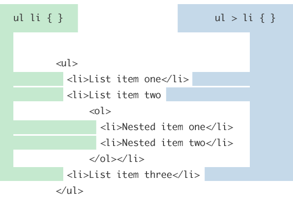

* Only select list items that are direct children of an `ul` (it only looks one level down)
* It can be thought of as a way to prevent styling from cascading down further than you would like it to.

#### Adjacent selector

 `div` + `p`

 

* Select an element that is directly after another specific element (on the same level i.e not nested)

 ##### General sibling combinator

 `div` ~ `p`

 * Select element after another specific element (on the same level).

 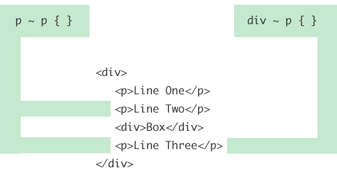

[Link](https://css-tricks.com/child-and-sibling-selectors/)

#### nth-of-type

Simple nth-of-type

`li:nth-of-type(2)`: selects the second element

```html
<li></li>
<li></li>  <!-- This would be selected -->  
<li></li>
<li></li>
```

`li:nth-of-type(4n+1)`: selects the 1st element in every series of four

```html
<li></li>  <!-- This would be selected -->
<li></li>
<li></li>
<li></li>

<li></li>  <!-- And this one... -->
<li></li>
<li></li>
<li></li>
```

#### Other selectors

`td:last-child` will select the third `td` element.

```html
<tr>
  <td>Green</td>
  <td>Eggs</td>
  <td>Ham</td>
<tr>
```

### HTML/CSS files: Setup

**Using stylesheets**

`rel` attribute: Links to stylesheet file

`<link rel="stylesheet" href="main.css">`

`href` points to directory of the HTML file, so using the  `main.css` file needs to be in the same directory as the HTML file

**Importing stylesheets**  
`@import url('')`  

If referencing multiple stylesheets in the HTML doc, only the first in the list can use `@import`?

### Color

Hexadecimal - default color value though when an alpha    
RGBa - Use when need transparency

### Sizing

#### Units

**Percentages**: Helpful for setting the height and width of elements and building out a web page’s layout that sizes fluidly.

**`em`**: A relative unit based on the computed value of the font size of the parent element.

* Use: Used for styling text, including font sizes, as well as spacing around text, including margins and paddings.
* Benefit: Can wrap elements within a container and know that all of the children will always be relative to one another:

```html
<div>
  <h2>Sample</h2>
</div>
```

```css
div { font-size: 16px }
h2 { font-size: 2em }
```

The computed value for the h2 font-size will be 32px.

**`rem`**
- dependent on the value of the root element (or the html element).

Basically root 16px. Ignores container size.

#### Width

* Default `inline` and `inline-block` elements width is determined by content size
* Default block width is `100%`*
  * Default `width` value is `auto`, and expands to occupy all (100%) of container's available horizontal space
  * `width: 100%` may be greater than 100% of container width as it includes padding and margin http://www.456bereastreet.com/lab/width-auto/
  * `width: 100%` can be useful, such as making images scale.

#### Height

* Default height is determined by content size

Inline-block elements can take `height` and `width` values.

## Box Model

### display values and the box model

#### inline

* Width & Height - Ignored. Defaults to content size
* Borders - Do not affect content around element (may overlap)
* Margin - No margin for inline elements
* Padding
  - Horizontal padding  
  - No vertical padding (sorta): Appears over the top of the (other) content above it, and underneath the content below it

#### inline-block

* Width determined by content (sits inline unlike block)
* Spacing: Able to take vertical margin and padding

#### Block

* Width: Default 100% (of container- takes up full line)

**Block level & inline elements**

Block level:
`<p>, <h1>, <h2>, <h3>, <h4>, <h5>, <h6>, <ul>, <ol>, <dl>, <pre>, <hr />, <blockquote>, and <address>`

Inline:
`<b>, <i>, <u>, <em>, <strong>, <sup>, <sub>, <big>, <small>, <li>, <ins>, <del>, <code>, <cite>, <dfn>, <kbd>, and <var>`

### box-sizing

`box-sizing` property has `content-box` (default) and `padding-box`, but `border-box` simplifies sizing by not allowing padding or borders to increase an element's size.

`border-box`

* Padding: A `400px` element with `border-box` remains `400px` regardless of how the size of borders or padding.  
* Margins: margins do need to be calculated.

There's a great interactive demo for this at MDN's entry for [box-sizing](https://developer.mozilla.org/en-US/docs/Web/CSS/box-sizing)

#### Adding spacing between floated or inline elements

Awesome, you've somehow managed to learn enough about floats to get a bunch of stuff in a row. Wohoo!

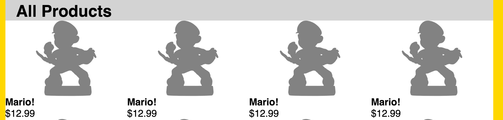

```css
li {
  float: left;
  width: 25%;
```

When you realize your site is looking like a blob of things smashed together, you'll probably want to create some spacing in between the different elements. If you add in `margin: 10px` to the CSS above you will get this:

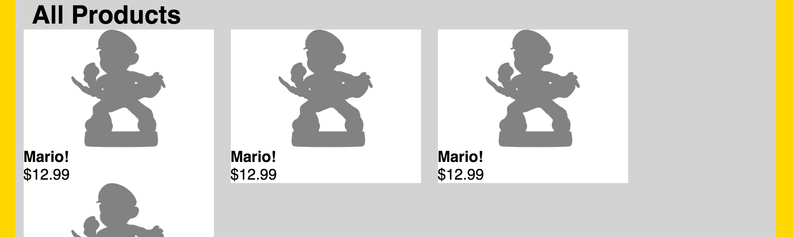

You could start using hard-coded widths, but those are a bummer. Instead change your CSS to use `border-box` and padding.

```css
li {
  float: left;
  width: 25%;
  box-sizing: border-box;
  padding: 10px;
```

`border-box` restricts the the element's size from expanding due to borders or padding, making this a nice way to add spacing using percent widths!

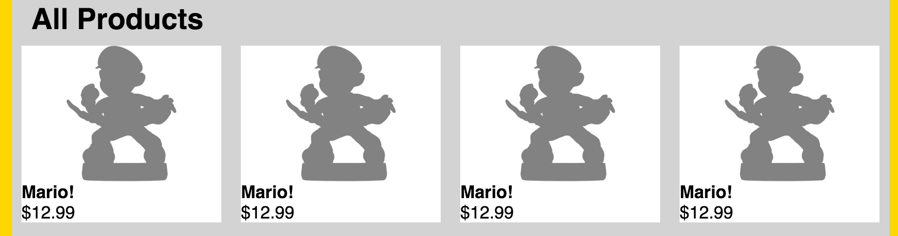

### Spacing - margin and padding:

If you're encountering issues here are some tips:

- Check how the box model affects your element (see above)
- Check for unexpected computed values in the inspector because CSS quicks can affect these (see margin collapse below)

#### Tip: Avoiding margin collapse

Sometimes you'll run into a situation where your margins are having no effect, and this is like caused by [margin-collapse](https://developer.mozilla.org/en-US/docs/Web/CSS/CSS_Box_Model/Mastering_margin_collapsing). It's described well in the linked article, but one of the most common situations is if two elements have adjacent margins. This type of situation can cause some of the margin spacing to the collapse. In other words, the margins conflict and (usually one element) will have a lower margin value on the side of the element with the conflict.

One way to avoid this to only apply margin in one direction. For example, if you were creating vertical spacing between elements in a list you could elect to just use bottom margin.

https://csswizardry.com/2012/06/single-direction-margin-declarations/

### Floats

**Float rules:**

* Flow: Removed from the normal flow (although still in document layout unlike `position: absolute` elements), and then shifted the left or right as far as possible.
* Positioning: When an element is floated, it will float all the way to the edge of its parent element. If there isn’t a parent element, the floated element will then float all the way to the edge of the page
* Width: The width defaults to content size and are block, so they will take up full horizontal space and will not sit as a column. Solution: specify a `width` value, usually a percent to make floating multiple elements easy.

**Float problems**

* Flow-overlap/collapse: A floated element's unfloated parent elements in a container will overlap the dimenstions of the floated element. The collapse is because the height of the parent container was being determined by the height of containing elements. Once child elements are removed are removed from the normal document flow, the height will be zero*
  * *Technically, if the parent container has a fixed height, then the container won't collapse (it would no longer be relying on the contained elements).
* Adjacent elements: Elements following a floated element will wrap around the floated element
* Display: Changes to `display: block` when floated
* Margin: Use margin so content does not overlap

**Example**

```html
<nav>
  <p>Navigation text</p>
  <p>More navigation text</p>
</nav>
<main>
    <p>I'm floated to the right</p>
</main>
```

In the example you could:

1. Float just the `main` element and give it a `width`.
2. Float `main` and `nav` elements with `left`/`right` values, and give them both widths.


#### Clearing floats

There are several ways to clear a float:

1) Clear. Just put `clear: both` on an element (display: block or table) directly after a floated one.

An element that has the clear property set on it will not move up adjacent to the float like the float desires, but will move itself down past the float

The cleared element will also allow the parent elements to configure to the dimensions of the original floated element.

2) Clearfix: Clear a psuedo-element that contains the floats using the same principles explained above. This is called a clearfix.

Simple example

```html
main:after {
  display: block;
  clear: both;
  content: "";
}
```

Things to remember:

- The pseuedo:element clearfix is default `display: inline`
- Clear after parent container with the floated elements

```html
<main>
 <div class="float1"></div>
 <div class="float2"></div>
</main>
```

Make the clearfix `main:after`, not after `float2`.

More complicated example

```css
.group:before,
.group:after {
  content: "";
  display: table;
}
.group:after {
  clear: both;
}
.group {
  clear: both;
```

This will clear floats above the floated group as well.

3) Set the parent element to `overflow: hidden` or `overflow: auto`

This will cause the parent to expand to contain the floats, effectively clearing it for succeeding elements.

May behave a bit differently than other solutions. For example:

* If you have two containers, you need to float the first one.
* Height and width expand automatically, unless you set either of those properties with values
* May have to deal with scroll arrows (differs by browser)
* Content that extends outside the borders of the parent element will be cut off.
* Nested elements with `position: absolute` may [disappear](http://front-back.com/how-to-make-absolute-positioned-elements-overlap-their-overflow-hidden-parent)

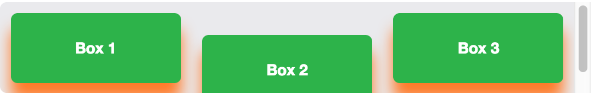

#### Float based layouts

##### Float three or more elements

```css
section {
  float: left;
  margin: 0 1.5%;
  width: 30%;
}
```

* Spacing notice!: If you want to add spacing in between your floated containers but don't want an element add `box-sizing: border-box:` and use padding (not margin!) to the CSS above.

##### Two column layout, somewhat fixed right width

```css
main {
  max-width: 800px; <!-- This will not work with width-->
}

div #id="first" {
  float: left;
  width: 65%;
}

div #id="second" {
  overflow: hidden;
}
```

https://codepen.io/dylankb/pen/ZOWOVv

If there is some white space surrounding the columns then this layout is serviceable. The whitespace is necessary because the left width is a percent, so the right width is not totally fixed and will start to shrink width eventually.

##### Two column layout, fixed left margin

- Left column fixed pixel width, float left
- Right column overflow: hidden

**Note:**

Since the two previous examples use `overflow: hidden`, so there are probably some limitations on the structure of our HTML. This is because you cannot apply `overflow: hidden` to the first (or perhaps any other column other than last one) and have it work.

##### Two columns, fixed + flexible columns (reversible)


- parent column takes right margin equal to negative right margin for the sidebar (right column)
- sidebar floats, takes fixed width <= negative margin
- main content column floated, width 100%

**Example:**
Fixed-width sidebar on the right.

```css
#columns {
  margin-right: 220px;
}

#secondary {
  float: right;
  width: 200px;
  margin-right: -220px;
  background: lightgreen;
}

#primary {
  float: left;
  width: 100%;
  background: lightyellow;
}
```

http://codepen.io/dylankb/pen/GqvLLO

This is also reversible (you switch the left hand column to a fixed width) without having to change the HTML structure. Below is an example with floated content.

http://codepen.io/dylankb/pen/qaeqjv

#### Non-layout:

Floating a second element to the boundary of the parent (or page).  

- Useful for having related pairs lined where the first element is variable in length without using a table


### Inline-block based layout

**Flexible array of elements**

Get a list of elements (li, etc.) into a number of columns and rows (3 X 2, 2 X 3, etc.)

- Give each item display value of inline-block
- Assign a percent based on how many you want per viewport. If you want 2 elements per row give each a width of 50% (or maybe 49% just to make it easy)
- If this does not create the desired result and your elements are still in a single row, for example, gradually give the elements more horizontal padding. Eventually the elements will force themselves into their appropriate rows.

#### Notes on inline & inline-block use

**Making a ul/li nav screen readable**

Say you have inline icons using something like this:

```css
footer li a {
  display: block;
  height: 46px;
  width: 46px;
  background: transparent url('../images/icons_social-media.png') 0 0 no-repeat;
}
```

To make it screen readable add text to the markup, but then remove it using this trick:

```css
text-indent: -9999px;
overflow: hidden;
display: block // or inline-block
```

This creates a bit of a performance hit because the screen has to render to such a large size, so here's a slightly better one.

```cs
text-indent: 100%
overflow: hidden;
display: block;
```

**Removing space between inline elements**

1. Remove line break: `</section><section>`
2. Comment out: `</section><!--`  
`--><section>`
3. Set font-size of parent element to 0

```css
ul {
 font-size: 0;
}

li {
  display: inline-block
}
```

**Problems with display: inline**

List items: Default value for list items is `display: list-item`. If you give `li` another `display` value it will fail to show the list-item icon.

## Positioning

### `position: absolute`

* Removed from document layout - sticks to that location and does not interact with other elements.
* Default width is content size (inline style).
* `left` property pushes right, etc. (like using padding-left to move something right). To move element all the way to the right, use `right: 0`.
* Positioned relative to nearest positioned (i.e `position: relative`) element, or if none relative to `body` element.
(must be nested inside positioned element)

```css
.red {
  background: red;
  width: 220px;
}

.blue {
  background: skyblue;
  position: absolute;
  top: 0;
  padding-top: 30px;
}
```

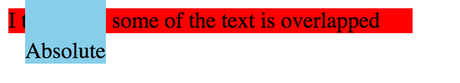

### `position: relative`

* Use top/bottom, left/right to move the element relative to where it would normally occur.
* affects layout of surrounding elements
* Block style width

Here's is basically the same CSS from the `position: absolute` example, except with the value changed to `relative`. You can see that it exists in the normal flow of the page as it's unable to overlap the element above.

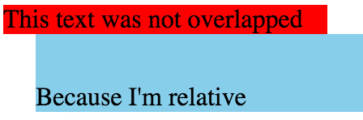

Elements with a position property appear relative to where they would normally occur. Here's another example to demonstrate where `p` tags take a relative position.

```css
p {
  position: relative;
  left: 50px;
  top: 30px;
}
```
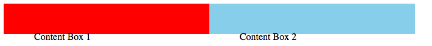

Other elements interact with the relatively positioned element as if it was in it's statically positioned location.

```html
<div class="blue">
  <p>Content Box 2</p>
  <span>Hey</p>
</div>
```

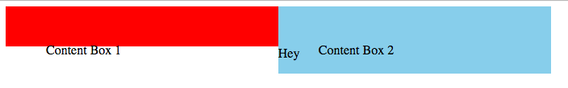


### `position: fixed`

* Removed from document layout, **moves with scroll**
* Useful to keep a top nav bar in place while scrolling

Problems

-  When the viewport becomes smaller than the element width there's a scrollbar. `max-width` can solve this problem.

#### Centering absolute elements

* `left` or `right: 50%`

If you give a value of `left: 50%`, this will put the left edge of the element at 50% of the container.

* negative margin `left` or `right` 1/2 of the elements width

Example:

With a `left: 50%` value you would then put a `margin-left:` value equal to 1/2 of the elements width.

**transform / translate**

You could also use transform / translate to achieve this result. Useful when:

- You want to do the mental math :)
- You don't know the height and width (say they are percentage values)

`translate` allows elements to be moved to horizontally and vertically.

If you wanted to horizontally and vertically center the element you would do something like this

```css
top: 50%,
left: 50%
transform: translate(-50%, 50%);
```

We've moved the element "too far" left, so we need to move it "back" -50% of the element's width. Likewise, the element is "too far" down, so it needs to move up 50%.

#### Creating a dropshadow on a modal popup

Some examples of positioning uses:

```css
input[type="checkbox"]:checked + figure::before {
  position: fixed;
  background: rgba(0, 0, 0, 0.4);
  top: 0;
  left: 0;
  right: 0;
  bottom: 0;
  z-index: 1;
  content: "";
}

input[type="checkbox"]:checked + figure img {
  height: 500px;
  position: absolute;
  top: 100px;
  left: 50%;
  margin-left: -200px;
  z-index: 2;
}
```

Here's a link to a [codepen](http://codepen.io/dylankb/pen/NAXQvN?editors=1100#0) that expands an image to create a modal, and creates a dropshadow.

**z-index**

Example: If elements are covered by an element after applying `z-index: 1`, then give other elements `z-index: 2`.
(This works better than applying `z-index: -1` to the original element.)

If you're completely confused why your `z-index` values are having no effect, it may have to do with stacking contexts. This [MDN piece](https://developer.mozilla.org/en-US/docs/Web/CSS/CSS_Positioning/Understanding_z_index/The_stacking_context) and this other article on stacking contexts may help [here](https://philipwalton.com/articles/what-no-one-told-you-about-z-index/). Some things that have worked for me are:
* Remove `position: relative` from parent with `overflow: hidden`
* Removing `overflow: hidden` from parent

#### Hiding an element with a checkbox

I used this in Rails issues project to create a CSS only way of closing flash notices. Here's the important CSS

```css
input[type="checkbox"] {display: none;}

// Hides alert message
input[type="checkbox"]:checked ~ .alert {
  display: none;
}

// Hides label so it can't be checked later
input[type="checkbox"]:checked + label {
  display: none;
}
```
```html
// Sample output
<input type="checkbox" id="error-1">
<label for="error"><span class="close">×</span></label>
<div class="alert alert-error">
  <span id="flash_error">Form error!</span>
</div>
```

Inspiration from:

http://www.outofscope.com/css-only-menu-toggle-no-javascript-required/

## Centering things

https://www.w3.org/Style/Examples/007/center.en.html#block

### Horizontally

#### `text-align: center` vs. `margin: 0 auto`:

Given a block element such as an `h1`, it will by default take up the full width of the container

```css
h1 { font-size: 50px; }
```

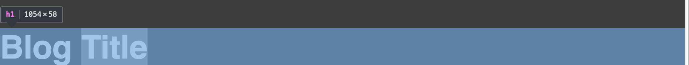

If you try and apply `margin: 0 auto` you will neither succeed in centering the `h1` nor the the inline text?

Why? A block container with a nonspecified with (or `width: 100%`)

`text-align: center` will work to center the text because the inline elements (the text) will move to the center of the width

If instead we tried to use `margin: 0 auto` to center the element this would not work. The element already takes up the full width of the container.

If you reduce the width of the element to less than 100% `margin: auto` will take affect.

```css
h1 {
  width: 25%;
  font-size: 50px;
  margin: 0 auto;
}
```

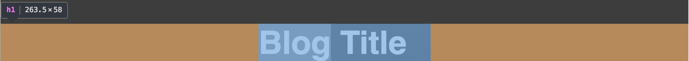

Although this is not the most robust centering strategy, (the centering will break if the font size increased) this method demonstrates the basics of why `margin: 0 auto` works in one case but not in another.

Things to remember:

* `text-align: center` will center the inline contents of the container.
* `margin: 0 auto` will center the container itself.
* Prefer restricting container size over creating large paddings.
* Use `margin: 0 auto` to center elements and even images inside containers with a set width ( besides `width: 100%`)
    * If you have a `width: auto` or 100% just use horizontal padding.
* `margin: 0 auto` does not work on floated elements even if they have widths defined (pretty sure)
* `margin: 0 auto` does not work on inline-block elements even if they have a specified width because:
    * Inline elements do not have a width property, and so the "auto" cannot be calculated.
    * Block elements have a width property, so the width of the "auto" can be calculated.
    * Inline-block elements have an outside which acts inline, but an inside which acts like a block. As such, the width set acts more like the width of a word in an inline element.

#### inline/inline-block element

Set parent container to `text-align: center`

All child elements inside that container will center themselves accordingly

#### Resizing an `img` in a container

The default `display` value for an image is `inline`, but it behaves most like `inline-block` (with some differences) in that it also a [replaced image](https://developer.mozilla.org/en-US/docs/Web/CSS/Replaced_element)

**Problem**

By default even though an image behaves like an `inline-block`, which resizes to fit content size, an image won't resize to fit it's container.

Why?

An `img` counts as an [inline, replaced element](https://www.w3.org/TR/CSS21/visudet.html#inline-replaced-width), and the docs provide this explanation for how their width is set.

>If 'height' and 'width' both have computed values of 'auto' and the element also has an intrinsic width, then that intrinsic width is the used value of 'width'.

I believe images have an intrinsic width (otherwise they wouldn't have dimensions, right?), so if `width` is set to `auto` the supplied dimensions will be the `width`. Therefore, on window resize images do not resize.

Here's an example of the issue. Try resizing this page (without changing anything) and notice and how the images overrun the other images they are sitting inline with:

https://codepen.io/dylankb/pen/bRpeya

**Getting images to resize**

As stated in the docs, there are a couple key factors that can be changed be changed to make an image no longer take the instrinsic width as it's dimensions.

**Scaling an image**

1) Change default `width` to something besides `auto`

For example if you change the width to `100%`, this will force the image to scale with page and container size.

**Flexible width image**

2) Change the height

For example, if you're trying to make image width flexible, keep the width `auto`, but make the height fixed value.

#### Centering an image (against a border color)

```css
figure img {
  display: block;
  width: 100%;
  margin: 0 auto;
  border: 10px solid #fff;
}

main {
  background: #363636;
  min-width: 600px;
  max-width: 1000px;
  padding: 20px;
  margin: 0 auto;
}
```

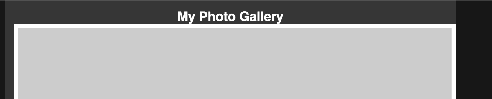

The figure image has a border of 10px on all sides, giving it a width of 1020px (10px + 1000px + 10px). There is padding on the `main` element of 20px on each side, which gives it a size of 1040px (20px + 1000px + 20px). Therefore the figure image covers up 20px of padding on the main element.

To show 20px of padding on each side, we need to make sure our image only has a width of 1000px.


To achieve this effect we need to apply `box-sizing: border-box;` to our `figure img` selector. This ensures that **padding & borders will not increase an element's size**.

#### Multiple images in a container w/ padding

```html
  <ul>
    <li>
      
    </li>
....
  </ul>
```

```css
 main li {
  display: inline-block;
  width: 24.5%;
  padding: 0 15px;
  box-sizing: border-box;
}
```

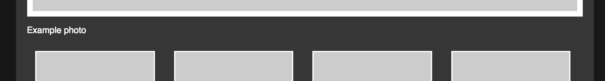

This pattern get's you close to a good layout, except that there is extra padding on the first and last image, causing them to not be in alignment with the main column edge and larger image above.

To address the extra left first you could use selectors such as:

```css
main li:first-of-type {
  padding-left: 0;
}
```

However, since we are using `box-sizing: border-box;` that first element will now have a different height and weight (which is a problem).

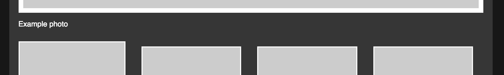

To address this without doing away with the convenience of simple widths plus `border-box`, we will get rid of the last selector and instead give negative margin.

```css
main ul {
  margin: 0 -15px
}
```

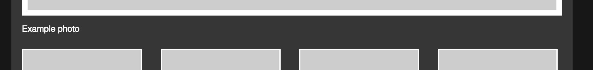

#### background images

A simple way to to center a background-image on your page (or container) is to set the background image to a block element.

Why a block element? Block elements with a width set to 100% (they are set to 100% by default) take up the full width of their container. This will make it easy for us keep track of where the middle of the container is.

When you go to use a background image you often use the `background` shorthand, and the minimum you need to write is something like this:

`background: url('logo.png') no-repeat`

However, this shorthand assumes a default value for the `background-position` property, is 0 0 (or 0% 0%). These values equal a left-top position for the image, and is in relation to the element the background-image was applied to (not its inline contents).

This explain why even if you have `text-align: center` applied to your block element, your image will still appear in the top left hand corner of the element.

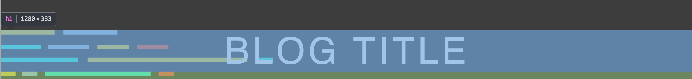

To get the background-image positioned in the center of the container `background: url('logo.png') 50% 0 no-repeat`

This will get you close, but your image and text will be overlapping. Check vertical centering for how to vertically center a background image.

#### block text

If you have several paragraphs of text and want to center their content you can create a wrapping div.

```html
<div class="content">
  <article>f
  <h3>Headline</h3>
  <p>Content for the article</p>
  </article>
<div>
```

```css
.content {
  max-width: 800px;
  margin: 0 auto;
}
```

#### Centering nav text

You want to center your nav items from the edge of the parent.

```html
<ul>
  <li>Apples</li>
  <ii>CSS</li>
  <li>JS</li>
<ul>
```

```css
ul {
  text-align: center;
}
```

#### Centering a positioned element

Center the element with a `left` or `right` value set to 50%, then create a margin (positive or negative) equal to 50% of the elements length

```css
.positioned {
  position: absolute;
  top: 0;
  width: 400px;
  left: 50%;
  margin-left: -200px;
}
```
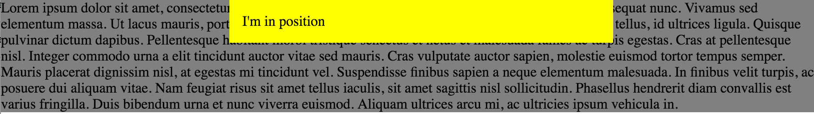

If you add a width to a parent element the `.positioned` element is no longer centered.

```css
section {
  width: 800px
}

.positioned {
  position: absolute;
  top: 0;
  width: 400px;
  left: 50%;
  margin-left: -200px;
}
```

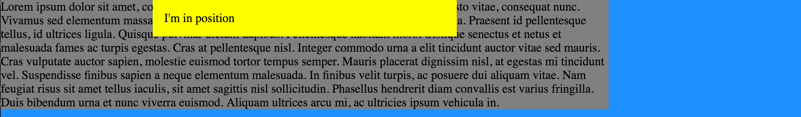

This is because if the `absolute` element has no positioned parent elements, it will be absolutely positioned relative to the body element.

How can we fix this?

> A page element with relative positioning gives you the control to absolutely position children elements inside of it. [link](https://css-tricks.com/absolute-positioning-inside-relative-positioning/)

To center the `.positioned` relative to `section`, `.positioned` must become a child of `section` in the markup and `section` must take a position (probably `relative`) value.

You can also use transform instead of a negative margin.

`transform: translate(-50%, 0);`

**Shrinking doooooown**

It's worth noting the if you reduced the size of the screen significantly you may want to have this element just take up the full of the screen.

```css
left: 0;
width: 100%;
margin: 0;
```

### Vertically

#### block elements

Centering on height is harder than width, but here are some hacks is:

1) `line-height`

Set `line-height` (of container?) equal to container's `height`

Works best with text, but it's better than playing around with padding.

2) `table-cell`

CSS2 ghetto style

```css
p {
  display: table-cell;
  vertical-align: middle
}
```

#### inline elements

You can `vertical-align: margin`

Main use is "to align text and elements next to text". Often this is images and text.

You can also use it for layouts, but it's tricky. Here's an [article](http://christopheraue.net/2014/03/05/vertical-align/) that goes through the fundamentals of what you'd need to know to really understand vertical-align.

Here's one very practical takeway, though:

##### Centering icon/image + text

Put `vertical-align: middle` on both elements.

If you only align the box with vertical-align: middle we are aligning it to the middle of the lower case letters without ascenders (half of the x-height). So, characters with ascenders stand out at the top.

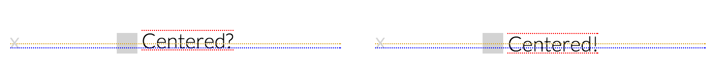

[Reference](http://christopheraue.net/2014/03/05/vertical-align/)

[Codepen](http://codepen.io/dylankb/pen/GqQJZr?editors=1100#0) example demonstrating this behavior.

##### background-images

To center a background image the inside a container I would probbably try and get height 100% on my container, and the give the background-position y value of 50%.

Say you have something like this:

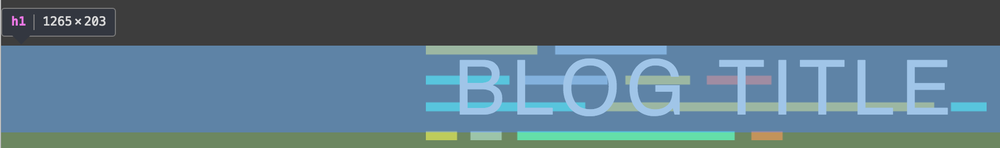

```css
h1 { text-align: center;
background: url('images/logo.png') 50% 0% no-repeat;
}
```

but would like to have the image to appear below.

1) Large enough element.

If you want to move your background image around, you have to have a large enough element to do so. The easiest way to increase an elements size in this case would be to apply padding to the vertical direction you wish to place the image. In this case we apply `padding-bottom: 125px` and `margin: 120px`. We want the bottom of our logo to be 120px below our text.

2) Use vertical positioning on the `background-position` property.

Now that our bottom padding extends to the bottom baseline where we want our image to site, the change is relatively simple. All we need to do is change background position to `background-position: 50% 100%` with 100% being the lowest vertical positioning.

The more complete shorthand is now: `background: url('images/logo.png') 50% 100% no-repeat;`

120px of margin is used to further create spacing after the logo.

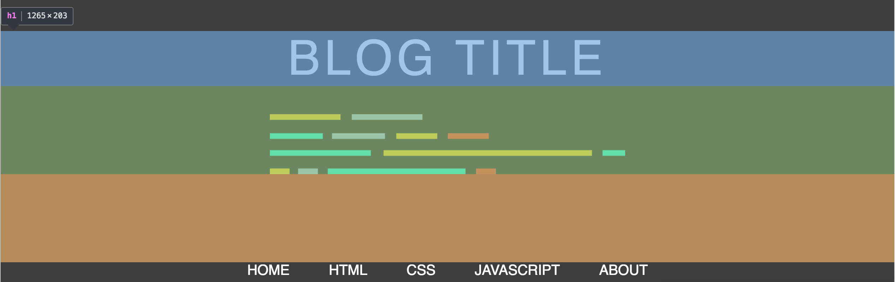

## Borders

### Aspect ratio

When thinking about the default spacing an element should take, it may be helpful to think about the screen size of the people viewing the page. For example, modern desktops are can often be about twice as wide as they are tall, so in this case you might double your width.

`padding: 8px 15px`

### `border-radius`

Avoiding flat edges: If you want buttons to not have flat edges (when the font changes), make sure the `border-radius` is larger than the font height.

Pixels values vs. percentage: Percentage widths can be great in certain instances, especially when making something like a circle, but can sometimes lead to unexpected shapes, especially for longer objects. Look at the MDN example for a `border-radius` of 50% [here](https://developer.mozilla.org/en-US/docs/Web/CSS/border-radius#Examples). A border radius equal to the font height (see above) would have more traditionally standard looking borders.

**Buttons**

* Perfect-circle images: To ensure you have a round image put a `border-radius` of 100% on all four corners. A shorthand for this is `border-radius: 100%`.

* Another metric is have the border-radius be greater than half the element's height

* Sizing: In general, avoid using fixed widths. Instead use vertical and horizontal padding to create the button shape you want. The base size will be determined by the inline contents (text). You cannot manually set the height.

* Borders:
  * You can create a second border with  `box-shadow`.
  * `box-shadow: 0 0 1px 1px #780e24` would create a lighter second border outside of the outer border.

## Responsiveness tips

-   Overflow/wrapping: Remember to check width, especially inline/inline-block elements that take into account spacing between tags.
-  Flexible image sizing: Change img widths to percents.
-  Don't specify a height: Without a height specified it will maintain aspect ratio.
-  If the img is `width:100%` then it's max width is size of its container  

## Layout types

1. Responsive - breakpoints
2. Liquid - uses percentage values for widths to maintain the same width ratios for content areas as the browser width changes. Generally liquid layouts will take up the entire width of the browser window, no matter how big it gets.
3. Fluid -  This layout will expand and collapse like a liquid layout to a point, then will remain a fixed width beyond that point. This is especially useful when you have text heavy layouts, since it becomes increasingly difficult to scan and read articles the wider they get.

### Responsive

Simple media query:

```
@media { max-width: pixel limit for breakpoint } {  
  css  
}

@media { max-width: 768px } {
  color: red;
}
```

**Media query mental model**

`min-width` works as well, but it's from a different perspective. `max-width` can be thought of as white-listing what you want to happen at smaller screen widths. In other words, "The stylesheet for screen sizes below value set for max-width (`max-width: value`) should have these different CSS properties/values (whatever's between `{ ... }`): ..."

### Fluid

- Images: Set image width to 100% to have image resize automatically.

Use `overflow:auto` or `hidden` on an element in a fluid layouts to have that element take up the remaining width

- With hidden, if anything inside the container is positioned outside of the box that makes up the parent, it will be cropped and and any parts not inside the parent will be hidden from view.
- With auto, you won't have the content cut off but you may have horizontal and vertical scroll bars appear depending on the browser and whether or not there is also a fixed height on the container.

- Content expands up to a point (max-width, etc.)

### Liquid

- Liquid layouts will take up the entire width of the browser window, no matter how big it gets

## Styling tables

###  Border spacing

One of the first decisions to make when styling a table is to think about how you want your borders to stack.

Having borders that don't stack means that your if you create a border around a table element, borders for table elements won't add to the total border width. This can simplifies things a bit.

`border-collapse` values

1. `collapse` - collapse border widths to not stack
2. `separate` (default) - border widths will stack up
3. `inherit`

However, one interesting effect you can make use of if opt for the default value `border-collapse: separate` is that you can use `border-spacing`

> `border-spacing` - determines space between borders. Only usable with `border-collapse: separate`

Here's an example of a table making use of `border-spacing`:

```css
table {
  border-collapse: separate;
  border-spacing: 4px;
}
table,
th,
td {
  border: 1px solid #cecfd5;
}
```

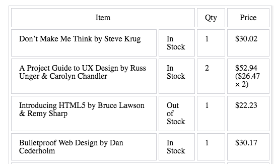

[Codepen](http://codepen.io/shayhowe/pen/geoAh) and original [source](http://learn.shayhowe.com/html-css/organizing-data-with-tables/)

The `table` selector creates an outer border, while the `th, td` selectors make up the inner cell borders.

### Styling borders (rows)

Barring certain resets, the example below will not create a continuous bottom-border for a row.

```css
table {
  border-collapse: seperate;
}
th,
td {
  border-bottom: 1px solid #cecfd5;
  padding: 10px 15px;
}
```

It will probably have spaces in between the `td`s like this:


To create a continuous bottom border either:

- Change to `border-collapse: collapse`
- Add `border-spacing: 0px`

Some resets include both (i.e Code Pen reset option), although some advise just using the `border-collapse: collapse` method.

**`tr` borders**

If you use `border-collapse: collapse`, you can now apply borders to `tr` elements.

### Spacing with table cells

**text-indent**

`th` and `td` are `display: table-cell` elements, and therefore [cannot take a margin](https://developer.mozilla.org/en-US/docs/Web/CSS/margin) (`tr` can't too)

Solutions:

1) Use `text-indent` for pixelated control over text spacing in a `td` or `th`.

2) Creating dummy/spacer `td`, like this

```html
  </tr>
    <td class="spacer"></td>
    <td>
      <dl>
        <dt>Saturated Fat</dt>
        <dd>1g</dd>
      </dl>
    </td>
    <td>5%</td>
  </tr>
```

```css
tbody tr .spacer {
  width: 20px;
  border-top: none;
}
```

The second option is useful if you want get rid of a top border

### Overriding table cell spacing

If you want to place two elements closer than their borders to get individual elements that look like this:

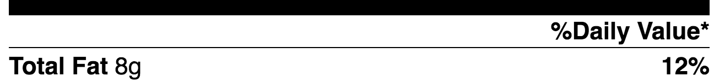

You're in for a challenge to turn just using `td` and `th` elements. Basic table markup like this

```html
<tr>
  <td>Total Fat</td>
  <td>8g</td>
  <td>12%</td>
</tr>
```
Makes it difficult to move the td elements because they are relatively fixed.

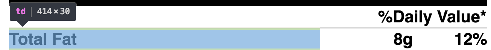

Using `colspan` with these elements doesn't seem to work. This code below:

```html
<tr>
  <th scope="row" colspan="2">
  <td>Total Fat</td>
  <td>8g</td>
  </th>
  <td>12%</td>
</tr>
```

Renders like this

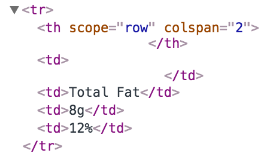

Some trickery with `dl` causes the `dl` to be rendered over two `col`s.

```html
<tr>
 <th scope="row" colspan="2">
  <dl>
    <dt>Total Fat</dt>
    <dd>8g</dd>
  </dl>
 </th>
 <td>12%</td>
</tr>
```
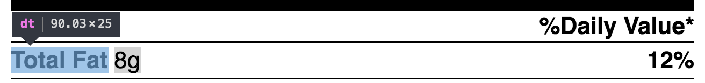

#### Centering images in a td

* `text-align:` to center and justify an image in a table cell

## Styling forms

A great reference for form layouts is [here](https://launchschool.com/lessons/b80a876c/assignments/20259df7) (paywall). These are some notes on that content.

### Vertical layout

**Label on top, input below**

* Alignment: `label { display: block }` to have input appear below the labels
* Spacing: add horizontal padding and bottom margin (to seperate from following input labels
* Font: To have input font match your page, make the same font declaration as you did in the body, main, etc.
* Borders: Adding a `border-radius` creates an inset styled border by default, so specify a border as well.
* Width: Assign a width of `100%`, but this may create a sliding bar due to extra padding and border dimensions, so use `border-box` as well

```css
label {
  display: block;
  padding-bottom: 10px;
}

input[type="text"] {
  width: 100%
  height: 40px;
  padding: 0 10px;
  margin-bottom: 10px;
  border: 1px solid #cecece
  border-radius: 4px;
  box-sizing: border-box;
}
```

### Horizontal

Challenge: getting non-breaking, clean labels and inputs inline

#### 1) Percentage width labels/input fields:

Pro: Ensure that input fields are aligned  
Cons: Labels may break w/ changing/larger fonts sizes  

```css
label {
  display: inline-block;
  width: 10%;
  vertical-align: middle;
  padding-right: 20%;
}

input[type="text"] {
  width: 90%;
  ...
}

div.row {
  padding-bottom: 20px;
}
```

#### 2) Fixed width labels

Pro: Non-breaking labels  
Cons: Difficult to get full width inputs   

#### 3) Use `dl`

- wrap `dl` around `dd` `dt` (label and input) to create a pair
- make `dd` and `dt` sit inline

Note - Remove extra whitespace between `dt` and `dl` with comments (or another tactic, like fuzzy percentages, `font-size` 0 out, etc.)

```css
dt {
  display: inline-block;
  width: 10%;
  vertical-align: middle;
  padding-right: 20px;
}

dd {
  display: inline-block;
  width: 90%
  margin: 0; <!--Removes default inset for dls -->
}

input[type="text"] {
  width: 100%;
  ...
}
```

#### multiple inline inputs

```css
dl.partial {
  display: inline-block;
  padding-right: 20px;
  box-sizing: border-box;
}

dl.city {
  width: 50%
}

dl.state {
  width: 25%
}

dl.zip {
  width: 25%
  padding-right: 0px;
}
```

```html
<dl class="city partial">
  <dt>
    <label for="city">City</label>
  </dt>
  <dd>
    <input type="text" name="city" id="city" />
  </dd>
</dl <!--
--><dl>
```

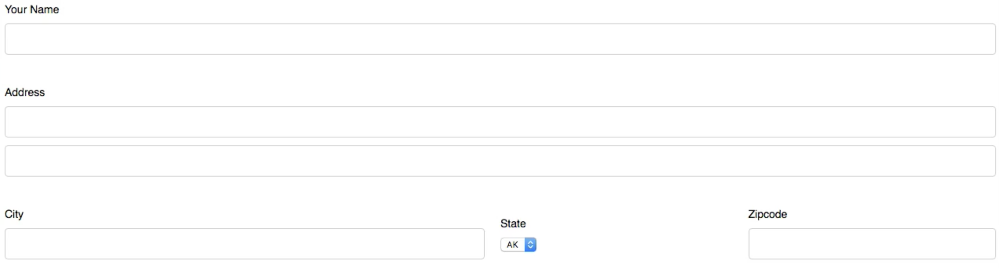

### Styling input[type="submit"]

The user agent style sheet provides a background for this type of button called `background: buttonface`.

To override and provide your own font, provide:

- A `background` value (can just be a color)
- A new font
- Change to `border: none;` (originally just above two, but

### Styling a default `select`

CSS below improves the default appearance for `select` elements

* Width: Width 100% could be a good idea
* appearance: none will help get rid of default styling;


```html
  width: 100%;
  height: 40px
  -webkit appearance: none;
  -moz appearance: none;
  appearance: none;
  ....
```

Here's another example

```css
.select-style {
  height: 32px;
  width: 120px;
  display: inline-block; #useful if you want multiple forms inline
}

.select-style select {
  background: transparent;
  border: none;  # this coupled with outline avoids the default rounded borders
  height: 32px;
  font-size: 16px;
  padding: 0 10px;
  width: 110px; # moves select arrow to the right
  outline: 1px solid #ccc;
  border-radius: 0;
}
```

### Displaying radio buttons vertically

A list of radio buttons are by default displayed inline (in a row). However,
we often need larger lists of radio buttons displayed vertically. Making the list
vertical isn't as easy as it seems like it should be - but there are a couple of
tricks that have worked for me.

1) Add the label text at the *after* of the input

Your first instinct is probably to format your HTML as so:

```html
<label>Blue
  <input type="radio" name="color" value="blue">
</label>
```

However this will actually cause the label text to display *in front
of* your radio button.

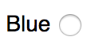

Switching to something like this should fix that issue.

```html
<label>
  <input type="radio" name="color" value="blue">Blue
</label>
```

Putting the label text outside the label displays correctly, but you now lose the ability to click on the label to select the radio.

```html
<label>
  <input type="radio" name="color" value="blue">
</label>Blue
```

2) Add `<li>` tags around each radio button

After getting the label on the right (and correct) side of the radio button it's
tempting to just throw a `display: block` on the label to get your horizontal
list vertical. However there's a problem; this will now cut off your label text
and display it on a new line.

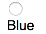

It's certainly possible to change your markup to use CSS to fix this issue, but
the easiest solution for me has been to just wrap each radio button in an `<li>`
tag.

```html
<li>
  <label>
    <input type="radio" name="color" value="blue">Blue
  </label>
</li>
```

or if you're into saving space you can make it a one liner.

```html
<li><label><input type="radio" name="color" value="blue">Blue</label></li>
```

This way, the only additional change to your CSS is to change your `<li>`'s'
`list-item` attribute value to `none`

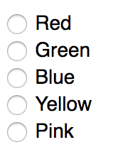

## Images

### img

* Loading images:
  * Define image paths in your CSS relative to the CSS file
  * Define images loaded from HTML file that displays everything:

* Use `max-width: 100%` to ensure that a picture does not flow over it's parent element. For example, the column it was placed in

* Use `border-radius: 50%` to make an image a circle.

### background-images

The basics for setting up a background image

- Give set height & width OR padding / margin
- display: inline-block or block
- background shorthand

#### background-position


* Similar to a graph, except the graph uses an inverted y (y is 100% at the bottom)
* Can use pixel or % values

**Background image TIPS**

#### Padding problems!: Use margins instead

If you're using fixed widths and images be careful of adding extra padding. Unless you change the element's `box-sizing` value, then padding will increase the element's size and distort the image.

#### Resizing a background-image

If adjusting height and width do not show the entire background image because the asset is too large, you can use

1) `background-size: cover`. This will expand (or shrink) the image so that it takes up the maximum space for the background size (the specs determined by your custom height & weight.

2) Use a pixel or other value for `background-size`. This can be useful if you purposefully want to cover up some of the image.

#### Other things to remember:

- height and width are the "view"
- background-size controls the image size
- Mitigating against slow load-time with a background color

If you're loading a large image, it can be good to set a default background color in case of slow loads.

`background: #2f2840 url('../images/bg_body.gif') 0 0 repeat;`

## Spritesheets

Typically use css selectors (classes/pseudo selectors):

1) Create "base" - width, height, image

```css
.battery {
  width: 64px;
  height: 124px;
  background: transparent url("battery_indicator.png") 0 0 no-repeat
}
```

The above CSS has background-position value, so this will show top icon on the spritesheet.

*Psuedo-selectors*

Psuedo-selectors can be helpful to do something like 'image' + 'text' inline. If you use them, make sure to include:

```css
content: ""
display: inline-block /* or display: block */
```

By default pseudo-elements are `display: inline`. `inline` can't take width or height dimensions, making the height and weight values effectively zero*

2) Image placement and sizing - position or varied height

To select a specific image, create a new css selector that allows you to override the `background-position` to move down y-axis with negative values equal to the height of that image. If image height is 124px then the image next from the top should be:

```css
.low {
  background-position: 0 -124px;
  height: 130px
}
```

Shortcuts: First image does not need a `background-position` property value. Final image can have a value of `0 100%`

### Spritesheet images as icon

Psuedo-selectors are a good choice

Hovering - `element:hover:before`

`background-size` & spritesheets

## Default styles & resets

If you create an HTML document it will inherit some styles from the default styles sheet.

Developers and designers use resets to modify these default styles as it offers:  
- more control: you can specify your own defaults
- more explicit: you will be less likely to be suprised by some default styling if you are writing them.

Default CSS styles example:

**Spacing**

`ul` elements have a default `padding-left` value of 40.
`dd` has a default `padding-left`

`h1` element's have default top and bottom margin/padding

**Font-size**

header elements (`h1`,`h2`, etc.) have default font-sizes

**Stylings**

`li` have default list-item-style values

## Useful shorthands

### `font`

* font-style, font-variant, font-weight, font-size, line-height, and font-family.
* Required: font-size and font-family

```css
body {
  font-size: 16px;
  font-weight: bold;
  font-variant: small-caps;
  font-style: italic;
  font-family: "Helvetica Neue", Helvetica, Arial, sans-serif;
  line-height: 140%;
}
```

Example:    
`font: italic small-caps bold 16px/140% "Helvetica Neue", Helvetica, Arial, sans-serif;`

A definitive PDF guide to the font shorthand can be found [here](assets/css-font-shorthand-cheat-sheet)

### Spacing

**Margin**

```css
div {
  margin: 10px 20px 0 15px;
}
```

* Format: top right bottom left ( counter-clockwise - same as Never Eat Shredded Wheat)
* Single values: Use longhand when only doing `top` f.e.
* Same goes for padding

### Borders

* border values: width, style, and color

`border: 5px, solid, red;`

### `background`

`background-color`, `background-image`, `background-position`, and then `background-repeat`.

Example:
```css
div {
  background: #b2b2b2 url("alert.png") 20px 10px no-repeat;
}
```

### Designs

#### Drawing with transform - creating an x

* Create a container for content with position `relative`
* Create two horizontal lines (larger width and smaller height) with psuedo selector elements position `absolute`
* Make psuedo-selector elements `top` 40-50%
* Place text after container
* Transform first 45%, the other -45%.

https://codepen.io/dylankb/pen/aybBpJ

## Frameworks

The basis of a framework is its grid system, or the css/markup interface for creating columns

Floated elements with a percentage width form the columns, while the parent container uses a clearfix to clear the floats.

```html
<ul class="row">
  <li class="fourth">1/4</li>
  <li class="fourth">1/4</li>
  <li class="fourth">1/4</li>
  <li class="fourth">1/4</li>
</ul>
```

```css
.row {
  clear: both;
}
.row:after {
  display: block;
  clear: both;
  line-height: 0;
  content: "";
}

.fourth {
  float: left;
  width: 25%;
}
```


To add margins between our columns we just need to add left margin to all columns except the first one. Here's a trick for doing so.

```css
.fourth + .fourth {
  margin-left: 2%;
}
```

However our widths already total 100%, so if we just go in and add margin our last column will fall onto its own new row.

To solve this let's think about how much margin we're adding. We are adding margin to all columns except the first, so in this case there are three 2 percent margins - so that's 6 percent total. To get this all to work we need to make our elements width total 6 percent less.

100 - 6 / 4 = 23.5

We need to create a css override to get this to work. If we just want to add the override class to the parent element we'd do it like this:

```css
.margin-row .fourth {
  width: 23.5%;
```

And then the markup would now look like this:

```html
<ul class="row margin-row">
  <li class="fourth">1/4</li>
  <li class="fourth">1/4</li>
  <li class="fourth">1/4</li>
  <li class="fourth">1/4</li>
</ul>
```


## Flexbox

### Vertically center text

This is for a flexbox, not a flex item. I'd like to be able to do this with a flex item though (element with text that's nested in a flexbox container)

https://stackoverflow.com/a/33049392

display: flex;
justify-content: center;
align-items: center;

## Planning

First things first, but not necessarily in that order

Things to do first:

* Plan: Think about the layouts you'll want to use, starting from the biggest and moving to the smallest. Think about the benefits and drawbacks of each.
* Sketch out some of these layouts w/ notations. Basically psuedo css code
* Breakpoints- Be mobile firstish in your planning. Understand how the page will change before you start implementing your CSS and markup - this will save time down the road. Should this block actually be two blocks so they can go inline later, etc.

## Debugging

**Getting unstuck**

Invariably you'll get stuck with some crazy behavior. The best way I've found is to to look through each affect (affecting?) element's property values at play and think. It's easy to just look at overflow: hidden and then move on, but actually thinking through what this property value does can help in the debugging process - sometimes it helps to describe how that might affect the layout out loud.

## Sass

Notes on post `http://krasimirtsonev.com/blog/article/SASS-mixins-extends-and-placeholders-differences-use-cases`

### `@mixins`

Simple example of a mixin

```sass
@mixin awesome {
    width: 100%;
    height: 100%;
}

body {
    @include awesome;
}
p {
    @include awesome;
}
```

```css
body {
    width: 960px;
    height: 100%;
}
p {
    width: 100%;
    height: 100%;
}
```

Useful, but it does create some duplicate css. For example, it would be more efficient to have the output be:

```css
body, p {
    width: 100%;
    height: 100%;
}
```

The mixins are very helpful if you need to change or calculate something in the final output. For example, if you need to apply border-radius to several elements. You probably use something like that:

Mixins are well fitting here, because at the end you have different value applied.

```sass
@mixin awesome($w: 100%, $h: 100%) {
    width: $w;
    height: $h;
}

body {
    @include awesome(960px);
}
p {
    @include awesome;
}
```
```css
body {
    width: 960px;
    height: 100%;
}
p {
    width: 100%;
    height: 100%;
}
```

### `@extends`

```sass
.awesome {
    width: 100%;
    height: 100%;
}

body {
    @extend .awesome;
}
p {
    @extend .awesome;
}
```
```css
.awesome, body, p {
    width: 100%;
    height: 100%;
}
```

### placeholders

```sass
%awesome {
    width: 100%;
    height: 100%;
}
body {
    @extend %awesome;
}
p {
    @extend %awesome;
}
```

This is the most optimal output.
```
body, p {
    width: 100%;
    height: 100%;
}
```

### `&`

[Reference](http://sass-lang.com/documentation/file.SASS_REFERENCE.html#Referencing_Parent_Selectors_____parent-selector)

`&` will be replaced with the parent selector as it appears in the CSS. This means that if you have a deeply nested rule, the parent selector will be fully resolved before the `&` is replaced. For example:

```sass
#main {
  color: black;
  a {
    font-weight: bold;
    &:hover { color: red; }
  }
}
```

```css
#main {
  color: black; }
  #main a {
    font-weight: bold; }
    #main a:hover {
      color: red; }
```

### Nesting

Nesting is a powerful tool in Sass. One thing that's cool is using it to namespace stuff. For example, you're building a widget an it needs be protected from outside styles, etc.

```sass
#some-container {
  @import "widget-styles";
}
```

https://codepen.io/trey/post/nesting-sass-includes

## Photoshop

Move (selector) - v  
Marquee (Lasso) - m  
Guides - Cmd + ;  
Eyedropper - i  
Eyedropper: select hex - Right click  

### Cutting out assets

- Auto Select: Layer and Show Transform Controls
- Right click, click Duplicate Layer
- Select Document: New
- Command + A
- Command + Shift + C
- Command + N
- Save for Web
- PNG-24 and check Transparency

### Grab group of images

- Right click on folder
- Click duplicate group, select New
- Command A (select all), Command Shift C (cut),
- Open new doc (Command N), make sure background is transparent if needed.
- Paste and click Save for Web
